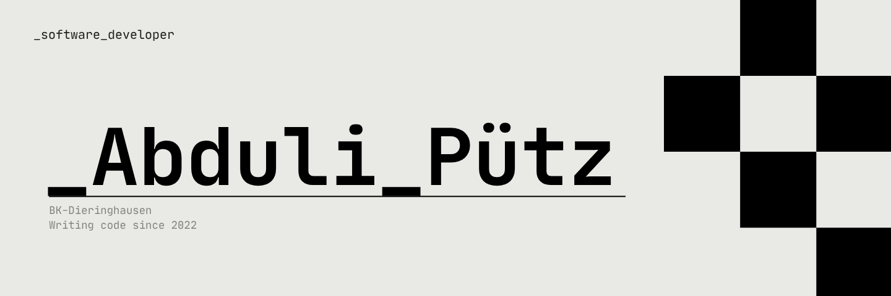

<u>[abduliputz.dev](https://abdulipuetz.pages.dev/)</u>

## About
Hi, I'm Abduli Pütz, a software developer and Information Technology Assistant (ITA) student from Germany. I'm focused on building software across web development, backend systems, databases, and developer tools, working primarily with C#, JavaScript, React, and SQL. I build independent projects to explore ideas, solve real problems, and deepen my understanding of software engineering. I'm interested in the intersection of technology, product, and developer experience, with the long-term goal of building software that people actually want to use.

## Projects

| Projects   | About it   | stach
| :------------ | :------------ |
| [Project CONEX](http://github.com/abduli-mp/conex "Project CONEX") | A client-to-technician support platform for reporting, tracking, scheduling, and resolving technical issues.  | React Vite + Tailwind + supabase (SQL)

## Experience

- _still_in_development

## Education

- _still_in_development

## Skills

- _still_in_development

## Contact

- _still_in_development

